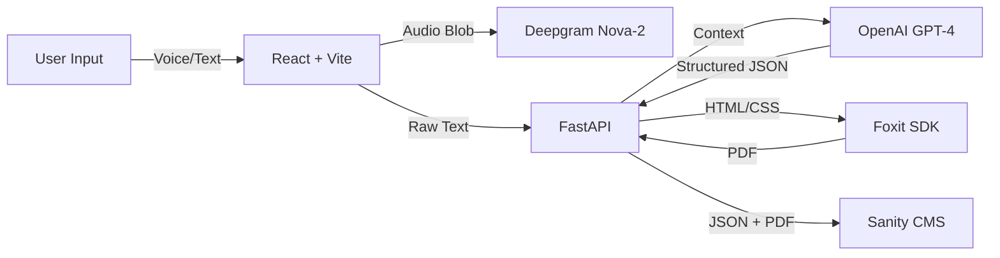

# 🧠 DocuMind: From Brain Dumb to Professional Doc in Seconds

> **Hackathon Submission 2026** | *Built with React, FastAPI, Deepgram, Foxit, and Sanity.*

---

## 🚀 The Problem
Meaningful work happens in conversations and rough notes, but **value is locked until it's formatted.**
Engineers hate writing docs. PMs spend hours formatting PRDs. Meetings end without clear action items.
Existing tools transcribe text but don't **structure** it into final, deliverable artifacts.

## 💡 The Solution
**DocuMind** is an intelligent document factory.
1.  **Ingest**: Speak naturally (Voice) or paste rough notes (Text).
2.  **Think**: Our AI Agent classifies the intent (Meeting, PRD, Docs) and extracts key structured data.
3.  **Create**: Generates a professional, branded PDF ready for stakeholders.
4.  **Preserve**: Archives everything in a Headless CMS (Sanity) for long-term retrieval.

---

## 🛠️ Architecture & Tech Stack



### ⚡ Powered By
-   **Frontend**: React, TailwindCSS, KendoReact UI.
-   **Backend**: Python FastAPI, Uvicorn.
-   **AI Intelligence**: OpenAI GPT-4o.

---

## ❤️ Sponsor Integrations

### 🗣️ Deepgram (Voice Intelligence)
We use **Deepgram Nova-2** for real-time, high-fidelity transcription.
-   *Implementation*: `backend/services/deepgram.py`
-   *Usage*: The "Voice Memo" feature in the Generator captures microphone input, sends it to Deepgram, and pipes the transcript directly into our structuring engine.

### 📄 Foxit (PDF Solutions)
We leveraged the **Foxit PDF SDK** (via HTML-to-PDF generation) to create professional-grade documents.
-   *Implementation*: `backend/services/foxit.py`
-   *Usage*: Converts crude AI outputs into polished, watermarked PDFs with proper headers, styling, and layout.

### ☁️ Sanity (Content Lake)
We use **Sanity Headless CMS** as our single source of truth.
-   *Implementation*: `backend/services/sanity.py`
-   *Usage*: Every generated document, its metadata (type, date), and the final PDF file are stored in Sanity, powering the **Dashboard**.

---

## 🏃‍♂️ Getting Started

### Prerequisites
-   Node.js 18+
-   Python 3.10+
-   API Keys for OpenAI, Deepgram, Foxit, and Sanity.

### 1. Backend Setup
```bash
cd backend
python -m venv venv
source venv/bin/activate
pip install -r requirements.txt

# Create .env file with your API keys
cp .env.example .env

# Start Server
uvicorn main:app --reload
```
*Server running at: http://localhost:8000*

### 2. Frontend Setup
```bash
cd frontend
npm install

# Start Client
npm run dev
```
*App running at: http://localhost:5173*

---

## 🎮 Demo Flow

1.  **Dashboard**: See your recent documents (fetched live from Sanity).
2.  **Generator**: Click "Launch App".
3.  **Input**:
    -   *Option A*: Type "Draft a PRD for a new login feature..."
    -   *Option B*: Click "Voice Memo" and say "Meeting notes, attendees were Alice and Bob, action item is to fix the bug."
4.  **Process**: Watch the AI agent analyze and structure the data.
5.  **Preview**: Review the JSON structure extracted.
6.  **Result**: Download your globally formatted PDF.

---

## 🔮 Future Roadmap
-   **Multi-Speaker Diarization**: richer meeting transcripts.
-   **Retool Admin Panel**: [See Setup Guide](docs/retool_setup.md) for internal document auditing.
-   **Two-Way Sync**: Edit the PDF and update the CMS automatically.
